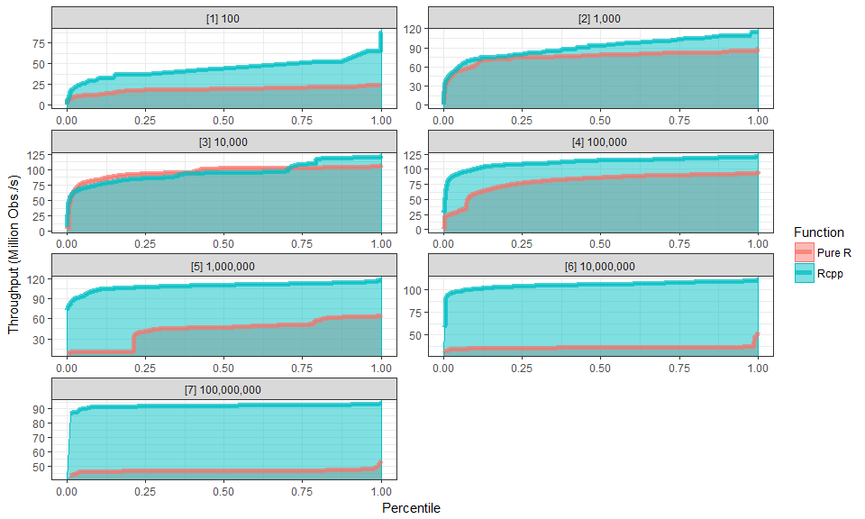

# R / Rcpp Benchmarking for Machine Learning Metrics

Benchmarking R and C++ for Machine Learning Metrics.

Code is provided here to copy & paste very quickly if needed to use immediately in R. Requires Rtools if using Windows.

Hardware / Software used:
* Intel i7-4600U
* Compilation flags for C/C++: `-O2 -mtune=core2` (R’s defaults)
* Windows 8.1 64-bit
* R 3.3.2 + Intel MKL (unless said otherwise)
* Rtools 34 + gcc 4.9

*Note: the metrics are tuned for speed. Algorithm wise, interpretability might be lost.<br>Which means if you were to explain, you will have issues.*

---

# Summary Benchmarks

Reported numbers are both for log10 weighted average (up) and peak performance (down):

* The multiplication factor `(Rcpp / R)` for the `Throughput+` (over 1 means Rcpp faster, lower than 1 means R faster)
* The throughput observations per second
* The peak vector size

| Benchmark | Throughput+ | Rcpp Throughput | R Throughput | Rcpp Peak | R Peak
| ------ | ---: | ---: | ---: | ---: | ---: |
| Binary Logarithmic Loss | log10 W Avg: **1.224x**<br>Peak Avg: **1.044x** | **18,113,090 obs/s**<br>**19,380,200 obs/s** | **14,801,221 obs/s**<br>**18,557,420 obs/s** | 1,000 | 10,000 |
| Multiclass Logarithmic Loss | log10 W Avg: **1.234x**<br>Peak Avg: **1.227x** | **14,807,458 obs/s**<br>**16,721,500 obs/s** | **12,000,957 obs/s**<br>**13,631,870 obs/s** | 1,000 | 10,000 |
| Area Under the Curve (ROC) | log10 W Avg: **1.432x**<br>Peak Avg: **1.266x** | **4,706,947 obs/s**<br>**9,162,998 obs/s** | **3,287,479 obs/s**<br>**7,235,654 obs/s** | 100 | 1,000 |
| Vector to Matrix to Vector | log10 W Avg: **1.327x**<br>Peak Avg: **1.404x** | **56,359,885 obs/s**<br>**87,803,300 obs/s** | **42,481,015 obs/s**<br>**62,528,900 obs/s** | 10,000 | 10,000 |
| Sine | log10 W Avg: **1.083x**<br>Peak Avg: **1.050x** | **23,089,263 obs/s**<br>**24,111,600 obs/s** | **21,327,489 obs/s**<br>**22,961,000 obs/s** | 1,000,000 | 10,000 |
| Cosine | log10 W Avg: **1.047x**<br>Peak Avg: **1.025x** | **21,228,563 obs/s**<br>**22,113,300 obs/s** | **20,280,469 obs/s**<br>**21,565,100 obs/s** | 100,000 | 10,000 |
| Tangent | log10 W Avg: **1.226x**<br>Peak Avg: **1.140x** | **56,551,314 obs/s**<br>**60,454,400 obs/s** | **46,108,091 obs/s**<br>**53,031,900 obs/s** | 100,000 | 1,000 |

---

# Metric Benchmarks

---

## Binary Logartihmic Loss: [benchmarks](https://htmlpreview.github.io/?https://github.com/Laurae2/R_benchmarking/blob/master/benchmarks/logloss.nb.html)

### Performance

Reported numbers (from log10 weighted average) are:

* Rcpp is in average **22.376% faster** than R.
* Rcpp has an estimated average throughput of **18,113,090** observations per second.
* R has an estimated average throughput of **14,801,221** observations per second.
* Fastest functions only. Compiled with `-O2 -mtune=core2` flags (R's defaults).

Reported numbers (from the peaks) are:
* Rcpp function throughput peaks at **1,000** observations per call.
* R function throughput peaks at **10,000** observations per call.
* Rcpp is at peak throughput in average **4.434% faster** than R.
* Rcpp has an estimated maximum throughput of **19,380,200** observations per second.
* R has an estimated maximum throughput of **18,557,420** observations per second.

| Log10 | Samples | Throughput+ | Rcpp Time | Pure R Time | Rcpp Throughput | Pure R Throughput |
| ---: | ---: | ---: | ---: | ---: | ---: | ---: |
| ~5.000 | log10 W.Avg. | **1.224x** | --- | --- | **18.113 M/s** | 14.801 M/s |
| ----- | ----- | ----- | ----- | ----- | ----- | ----- |
| ~2.000 | 100 | **4.529x** | **6.887 μs** | 31.192 μs | **14.520 M/s** | 3.206 M/s |
| ~3.000 | 1,000 | **1.543x** | **51.599 μs** | 79.600 μs | **19.380 M/s** | 12.563 M/s |
| ~4.000 | 10,000 | 0.983x | 548.412 μs | **538.868 μs** | 18.234 M/s | **18.557 M/s** |
| ~5.000 | 100,000 | **1.036x** | **5.403 ms** | 5.596 ms | **18.507 M/s** | 17.870 M/s |
| ~6.000 | 1,000,000 | **1.313x** | **54.333 ms** | 71.330 ms | **18.405 M/s** | 14.019 M/s |
| ~7.000 | 10,000,000 | **1.208x** | **558.664 ms** | 674.816 ms | **17.900 M/s** | 14.819 M/s |
| ~8.000 | 100,000,000 | **1.188x** | **5.496  s** | 6.530  s | **18.197 M/s** | 15.314 M/s |


### Rules (1,000,000 observations)

For a 2-class vector of 1,000,000 observations:

* Vector A of length=(1000000)
* Vector B of length=(1000000) with 2 classes

```
A = [1, 2, 3, 4, ..., 1000000]
B = [0, 1, 1, 0, ...]
```

Get the following Vector C and D:

```
C = Clamped A by 1e-15
D = Mean of logloss(C, B)
```

### Best code

`Lpp_logloss(preds, labels, eps)`:

* preds = your predictions (between 0 and 1)
* labels = your labels (binary, 0 or 1)
* eps = the clamping on [0, 1]

```r
cppFunction("double Lpp_logloss(NumericVector preds, NumericVector labels, double eps) {
  int label_size = labels.size();
  NumericVector clamped(label_size);
  clamped = clamp(eps, preds, 1 - eps);
  NumericVector loggy(label_size);
  loggy = -log((1 - labels) + ((2 * labels - 1) * clamped));
  double logloss = sum(loggy) / label_size;
  return logloss;
}")
```

---

## Multiclass Logarithmic Loss: [benchmarks](https://htmlpreview.github.io/?https://github.com/Laurae2/R_benchmarking/blob/master/benchmarks/mlogloss.nb.html)

### Performance

Reported numbers (from log10 weighted average) are:

* Rcpp is in average **23.386% faster** than R.
* Rcpp has an estimated average throughput of **14,807,458** observations per second.
* R has an estimated average throughput of **12,000,957** observations per second.
* Fastest functions only. Compiled with `-O2 -mtune=core2` flags (R's defaults).

Reported numbers (from the peaks) are:
* Rcpp function throughput peaks at **1,000** observations per call.
* R function throughput peaks at **10,000** observations per call.
* Rcpp is at peak throughput in average **22.665% faster** than R.
* Rcpp has an estimated maximum throughput of **16,721,500** observations per second.
* R has an estimated maximum throughput of **13,631,870** observations per second.

| Log10 | Samples | Throughput+ | Rcpp Time | Pure R Time | Rcpp Throughput | Pure R Throughput |
| ---: | ---: | ---: | ---: | ---: | ---: | ---: |
| ~4.500 | log10 W.Avg. | **1.234x** | --- | --- | **14.807 M/s** | 12.001 M/s |
| ----- | ----- | ----- | ----- | ----- | ----- | ----- |
| ~2.000 | 100 | **4.527x** | **8.035 μs** | 36.378 μs | **12.445 M/s** | 2.749 M/s |
| ~3.000 | 1,000 | **1.477x** | **59.803 μs** | 88.320 μs | **16.722 M/s** | 11.322 M/s |
| ~4.000 | 10,000 | **1.151x** | **637.224 μs** | 733.575 μs | **15.693 M/s** | 13.632 M/s |
| ~5.000 | 100,000 | **1.139x** | **6.448 ms** | 7.341 ms | **15.509 M/s** | 13.622 M/s |
| ~6.000 | 1,000,000 | **1.149x** | **64.718 ms** | 74.377 ms | **15.452 M/s** | 13.445 M/s |
| ~7.000 | 10,000,000 | **1.129x** | **763.214 ms** | 861.487 ms | **13.102 M/s** | 11.608 M/s |


### Rules (1,000,000 observations)

For a 10-class vector of 1,000,000 observations:

* Vector A of length=(1000000 * 10)
* Vector B of length=(1000000) with 10 classes

```
A = [1:1, 1:2, 1:3, 1:4... 1:10, 2:1, 2:2, 2:3..., 1000000:8, 1000000:9, 1000000:10]
B = [3, 5, 9, 1, 4, 8, 6, ...]
```

Get the following Vector C, D, and E:

```
C = [1:4, 2:6, 3:10, 4:2, 5:5, 6:9, 7:7, ...]
D = Clamped C by 1e-15
E = Mean of logloss(D, B)
```

### Best code

`Lpp_mlogloss(preds, labels, eps)`:

* preds = your predictions (size = `length(labels) * number of different labels`)
* labels = your labels (starting from 0)
* eps = the clamping on [0, 1]

```r
Rcpp::cppFunction("double Lpp_mlogloss(NumericVector preds, NumericVector labels, double eps) {
  int labels_size = labels.size();
  NumericVector selected(labels_size);
  selected = (preds.size() / labels_size) * seq(0, labels_size - 1);
  selected = selected + labels;
  NumericVector to_return(labels_size);
  to_return = preds[selected];
  NumericVector clamped = clamp(eps, to_return, 1 - eps);
  NumericVector loggy = -(log(1 - clamped));
  double logloss = sum(loggy) / labels_size;
  return logloss;
}")
```

---

## Area Under the Curve (ROC): [benchmarks](https://htmlpreview.github.io/?https://github.com/Laurae2/R_benchmarking/blob/master/benchmarks/roc.nb.html)

### Performance

Reported numbers (from log10 weighted average) are:

* Rcpp is in average **43.178% faster** than R.
* Rcpp has an estimated average throughput of **4,706,947** observations per second.
* R has an estimated average throughput of **3,287,479** observations per second.
* Fastest functions only. Compiled with `-O2 -mtune=core2` flags (R's defaults).

Reported numbers (from the peaks) are:
* Rcpp function throughput peaks at **100** observations per call.
* R function throughput peaks at **1,000** observations per call.
* Rcpp is at peak throughput in average **26.637% faster** than R.
* Rcpp has an estimated maximum throughput of **9,162,998** observations per second.
* R has an estimated maximum throughput of **7,235,654** observations per second.

| Log10 | Samples | Throughput+ | Rcpp Time | Pure R Time | Rcpp Throughput | Pure R Throughput |
| ---: | ---: | ---: | ---: | ---: | ---: | ---: |
| ~4.500 | log10 W.Avg. | **1.432x** | --- | --- | **4.707 M/s** | 3.287 M/s |
| ----- | ----- | ----- | ----- | ----- | ----- | ----- |
| ~2.000 | 100 | **2.861x** | **10.914 μs** | 31.223 μs | **9.163 M/s** | 3.203 M/s |
| ~3.000 | 1,000 | 0.987x | 140.019 μs | **138.205 μs** | 7.142 M/s | **7.236 M/s** |
| ~4.000 | 10,000 | 0.983x | 1.589 ms | **1.562 ms** | 6.292 M/s | **6.400 M/s** |
| ~5.000 | 100,000 | **1.217x** | **19.980 ms** | 24.309 ms | **5.005 M/s** | 4.114 M/s |
| ~6.000 | 1,000,000 | **2.109x** | **327.093 ms** | 689.814 ms | **3.057 M/s** | 1.450 M/s |
| ~7.000 | 10,000,000 | **3.252x** | **3.723  s** | 12.108  s | **2,685.830 K/s** | 825.897 K/s |


### Rules (500,000 observations)

For a 2-class vector of 500,000 observations:

* Vector A of length=(500000)
* Vector B of length=(500000) with 2 classes

```
A = [1, 2, 3, 4, ..., 500000]
B = [0, 1, 1, 0, ...]
```

Get the following Vector C:

C = ROC of A and B

### Best code

`Lpp_ROC(preds, labels)`:

* preds = your predictions
* labels = your labels (binary, 0 or 1)

```r
cppFunction("double Lpp_ROC(NumericVector preds, NumericVector labels) {
  double LabelSize = labels.size();
  NumericVector ranked(LabelSize);
  NumericVector positives = preds[labels == 1];
  double n1 = positives.size();
  Range positives_seq = seq(0, n1 - 1);
  ranked[seq(0, n1 - 1)] = positives;
  double n2 = LabelSize - n1;
  NumericVector negatives = preds[labels == 0];
  NumericVector x2(n2);
  ranked[seq(n1, n1 + n2)] = negatives;
  ranked = match(ranked, clone(ranked).sort());
  double AUC = (sum(ranked[positives_seq]) - n1 * (n1 + 1)/2)/(n1 * n2);
  return AUC;
}")
```

---

## Symmetric Mean Average Percentage Error (SMAPE with R 3.3.2, gcc 4.9): [benchmarks](https://htmlpreview.github.io/?https://github.com/Laurae2/R_benchmarking/blob/master/benchmarks/smape_3.3.2mkl.nb.html)

### Performance

Reported numbers (from log10 weighted average) are:

* Rcpp is in average **94.945% faster** than R.
* Rcpp has an estimated average throughput of **96,532,971** observations per second.
* R has an estimated average throughput of **49,518,000** observations per second.
* Fastest functions only. Compiled with `-O2 -mtune=core2` flags (R's defaults).

Reported numbers (from the peaks) are:
* Rcpp function throughput peaks at **100,000** observations per call.
* R function throughput peaks at **10,000** observations per call.
* Rcpp is at peak throughput in average **25.503% faster** than R.
* Rcpp has an estimated maximum throughput of **110,431,900** observations per second.
* R has an estimated maximum throughput of **87,991,400** observations per second.

| Log10 | Samples | Throughput+ | Rcpp Time | Pure R Time | Rcpp Throughput | Pure R Throughput |
| ---: | ---: | ---: | ---: | ---: | ---: | ---: |
| ~5.000 | log10 W.Avg. | **1.949x** | --- | --- | **96.533 M/s** | 49.518 M/s |
| ----- | ----- | ----- | ----- | ----- | ----- | ----- |
| ~2.000 | 100 | **2.186x** | **2.653 μs** | 5.799 μs | **37.699 M/s** | 17.246 M/s |
| ~3.000 | 1,000 | **1.245x** | **11.737 μs** | 14.615 μs | **85.202 M/s** | 68.421 M/s |
| ~4.000 | 10,000 | **1.050x** | **108.252 μs** | 113.647 μs | **92.377 M/s** | 87.991 M/s |
| ~5.000 | 100,000 | **1.604x** | **905.535 μs** | 1452.833 μs | **110.432 M/s** | 68.831 M/s |
| ~6.000 | 1,000,000 | **3.872x** | **9.216 ms** | 35.684 ms | **108.502 M/s** | 28.024 M/s |
| ~7.000 | 10,000,000 | **2.924x** | **94.960 ms** | 277.640 ms | **105.308 M/s** | 36.018 M/s |
| ~8.000 | 100,000,000 | **1.957x** | **1.084  s** | 2.122  s | **92.228 M/s** | 47.123 M/s |



### Rules (1,000,000 observations)

For a regression vector of 1,000,000 observations:

* Vector A of length=(1000000)
* Vector B of length=(1000000)

```
A = [1, 2, 3, 4, ..., 1000000]
B = [1, 2, 3, 4, ..., 1000000]
```

Get the following Vector C:

C = SMAPE of A and B

### Best code

`Lpp_ROC(preds, labels)`:

* preds = your predictions
* labels = your labels (binary, 0 or 1)

```r
cppFunction("double Lpp_SMAPE(NumericVector preds, NumericVector labels) {
  int labels_size = labels.size();
  NumericVector zeroes(labels_size);
  zeroes = (abs(labels - preds)) / (abs(labels) + abs(preds));
  LogicalVector nan = is_nan(zeroes);
  double loss = 0;
  for (int i = 0; i < labels_size; i++) {
    if (!nan[i])
      loss += zeroes[i];
  }
  return(2 * loss / labels_size);
}")
```

---

## Symmetric Mean Average Percentage Error (SMAPE with R 3.4.0 precompiled, gcc 7.1): [benchmarks](https://htmlpreview.github.io/?https://github.com/Laurae2/R_benchmarking/blob/master/benchmarks/smape_3.4.0.nb.html)

### Performance

Reported numbers (from log10 weighted average) are:

* Rcpp is in average **65.543% faster** than R.
* Rcpp has an estimated average throughput of **97,085,266** observations per second.
* R has an estimated average throughput of **58,646,657** observations per second.
* Fastest functions only. Compiled with `-O2 -mtune=core2` flags (R's defaults).

Reported numbers (from the peaks) are:
* Rcpp function throughput peaks at **100,000** observations per call.
* R function throughput peaks at **10,000** observations per call.
* Rcpp is at peak throughput in average **20.260% faster** than R.
* Rcpp has an estimated maximum throughput of **110,976,100** observations per second.
* R has an estimated maximum throughput of **92,279,800** observations per second.

| Log10 | Samples | Throughput+ | Rcpp Time | Pure R Time | Rcpp Throughput | Pure R Throughput |
| ---: | ---: | ---: | ---: | ---: | ---: | ---: |
| ~5.000 | log10 W.Avg. | **1.655x** | --- | --- | **97.085 M/s** | 58.647 M/s |
| ----- | ----- | ----- | ----- | ----- | ----- | ----- |
| ~2.000 | 100 | **1.271x** | **2.611 μs** | 3.318 μs | **38.295 M/s** | 30.135 M/s |
| ~3.000 | 1,000 | **1.072x** | **11.671 μs** | 12.515 μs | **85.686 M/s** | 79.902 M/s |
| ~4.000 | 10,000 | **1.007x** | **107.622 μs** | 108.366 μs | **92.918 M/s** | 92.280 M/s |
| ~5.000 | 100,000 | **1.481x** | **901.095 μs** | 1334.494 μs | **110.976 M/s** | 74.935 M/s |
| ~6.000 | 1,000,000 | **2.307x** | **9.217 ms** | 21.260 ms | **108.497 M/s** | 47.036 M/s |
| ~7.000 | 10,000,000 | **2.222x** | **93.505 ms** | 207.722 ms | **106.946 M/s** | 48.141 M/s |
| ~8.000 | 100,000,000 | **1.894x** | **1.084  s** | 2.053  s | **92.273 M/s** | 48.707 M/s |


### Rules (1,000,000 observations)

For a regression vector of 1,000,000 observations:

* Vector A of length=(1000000)
* Vector B of length=(1000000)

```
A = [1, 2, 3, 4, ..., 1000000]
B = [1, 2, 3, 4, ..., 1000000]
```

Get the following Vector C:

C = SMAPE of A and B

### Best code

`Lpp_ROC(preds, labels)`:

* preds = your predictions
* labels = your labels (binary, 0 or 1)

```r
cppFunction("double Lpp_SMAPE(NumericVector preds, NumericVector labels) {
  int labels_size = labels.size();
  NumericVector zeroes(labels_size);
  zeroes = (abs(labels - preds)) / (abs(labels) + abs(preds));
  LogicalVector nan = is_nan(zeroes);
  double loss = 0;
  for (int i = 0; i < labels_size; i++) {
    if (!nan[i])
      loss += zeroes[i];
  }
  return(2 * loss / labels_size);
}")
```

---

# Utilities Benchmarks

---

## Vector to Matrix to Vector: [benchmarks](https://htmlpreview.github.io/?https://github.com/Laurae2/R_benchmarking/blob/master/benchmarks/vect2mat2vect.nb.html)

### Performance

Reported numbers (from log10 weighted average) are:

* Rcpp is in average **32.671% faster** than R.
* Rcpp has an estimated average throughput of **56,359,885** observations per second.
* R has an estimated average throughput of **42,481,015** observations per second.
* Fastest functions only. Compiled with `-O2 -mtune=core2` flags (R's defaults).

Reported numbers (from the peaks) are:
* Rcpp function throughput peaks at **10,000** observations per call.
* R function throughput peaks at **10,000** observations per call.
* Rcpp is at peak throughput in average **40.420% faster** than R.
* Rcpp has an estimated maximum throughput of **87,803,300** observations per second.
* R has an estimated maximum throughput of **62,528,900** observations per second.

| Log10 | Samples | Throughput+ | Rcpp Time | Pure R Time | Rcpp Throughput | Pure R Throughput |
| ---: | ---: | ---: | ---: | ---: | ---: | ---: |
| ~4.500 | log10 W.Avg. | **1.327x** | --- | --- | **56.360 M/s** | 42.481 M/s |
| ----- | ----- | ----- | ----- | ----- | ----- | ----- |
| ~2.000 | 100 | **2.037x** | **3.294 μs** | 6.711 μs | **30.354 M/s** | 14.901 M/s |
| ~3.000 | 1,000 | **1.429x** | **15.316 μs** | 21.887 μs | **65.292 M/s** | 45.689 M/s |
| ~4.000 | 10,000 | **1.404x** | **113.891 μs** | 159.926 μs | **87.803 M/s** | 62.529 M/s |
| ~5.000 | 100,000 | **1.356x** | **1.671 ms** | 2.266 ms | **59.856 M/s** | 44.136 M/s |
| ~6.000 | 1,000,000 | **1.269x** | **18.539 ms** | 23.534 ms | **53.942 M/s** | 42.492 M/s |
| ~7.000 | 10,000,000 | **1.144x** | **240.559 ms** | 275.188 ms | **41.570 M/s** | 36.339 M/s |


### Rules (1,000,000 observations)

For a 10-class vector of 1,000,000 observations:

* Vector A of length=(1000000 * 10)
* Vector B of length=(1000000) with 10 classes

```
A = [1:1, 1:2, 1:3, 1:4... 1:10, 2:1, 2:2, 2:3..., 1000000:8, 1000000:9, 1000000:10]
B = [3, 5, 9, 1, 4, 8, 6, ...]
```

Get the following Vector C:

```
C = [1:4, 2:6, 3:10, 4:2, 5:5, 6:9, 7:7, ...]
```

### Best code

`Lpp_vect2mat2vect(preds, labels)`:

* preds = your predictions (size = `length(labels) * number of different labels`)
* labels = your labels (starting from 0)

```r
Rcpp::cppFunction("NumericVector Lpp_vect2mat2vect(NumericVector preds, NumericVector labels) {
  int labels_size = labels.size();
  NumericVector selected(labels_size);
  selected = (preds.size() / labels_size) * seq(0, labels_size - 1);
  selected = selected + labels;
  NumericVector to_return(labels_size);
  to_return = preds[selected];
  return to_return;
}")
```

## Sine: [benchmarks](https://htmlpreview.github.io/?https://github.com/Laurae2/R_benchmarking/blob/master/benchmarks/sine.nb.html)

### Performance

Reported numbers (from log10 weighted average) are:

* Rcpp is in average **8.261% faster** than R.
* Rcpp has an estimated average throughput of **23,089,263** observations per second.
* R has an estimated average throughput of **21,327,489** observations per second.
* Fastest functions only. Compiled with `-O2 -mtune=core2` flags (R's defaults).

Reported numbers (from the peaks) are:
* Rcpp function throughput peaks at **1,000,000** observations per call.
* R function throughput peaks at **10,000** observations per call.
* Rcpp is at peak throughput in average **5.011% faster** than R.
* Rcpp has an estimated maximum throughput of **24,111,600** observations per second.
* R has an estimated maximum throughput of **22,961,000** observations per second.

| Log10 | Samples | Throughput+ | Rcpp Time | Pure R Time | Rcpp Throughput | Pure R Throughput |
| ---: | ---: | ---: | ---: | ---: | ---: | ---: |
| ~5.000 | log10 W.Avg. | **1.083x** | --- | --- | **23.089 M/s** | 21.327 M/s |
| ----- | ----- | ----- | ----- | ----- | ----- | ----- |
| ~2.000 | 100 | **1.150x** | **6.088 μs** | 7.002 μs | **16.425 M/s** | 14.281 M/s |
| ~3.000 | 1,000 | **1.024x** | **44.963 μs** | 46.039 μs | **22.240 M/s** | 21.721 M/s |
| ~4.000 | 10,000 | **1.023x** | **425.543 μs** | 435.522 μs | **23.499 M/s** | 22.961 M/s |
| ~5.000 | 100,000 | **1.056x** | **4.160 ms** | 4.395 ms | **24.036 M/s** | 22.754 M/s |
| ~6.000 | 1,000,000 | **1.154x** | **41.474 ms** | 47.870 ms | **24.112 M/s** | 20.890 M/s |
| ~7.000 | 10,000,000 | **1.111x** | **415.696 ms** | 461.986 ms | **24.056 M/s** | 21.646 M/s |
| ~8.000 | 100,000,000 | **1.065x** | **4.412  s** | 4.698  s | **22.664 M/s** | 21.283 M/s |


### Rules (1,000,000 observations)

For a 10-class vector of 1,000,000 observations:

* Vector A of length=(1000000)

```
A = [1, 2, 3, 4, ..., 1000000]
```

Get the following Vector B:

```
B = sin(A)
```

### Best code

`Lpp_sin(x)`:

* x = your vector to apply `sin` on.

```r
cppFunction("NumericVector Lpp_sin(NumericVector x) {
  return sin(x);
}")
```

## Cosine: [benchmarks](https://htmlpreview.github.io/?https://github.com/Laurae2/R_benchmarking/blob/master/benchmarks/cosine.nb.html)

### Performance

Reported numbers (from log10 weighted average) are:

* Rcpp is in average **4.675% faster** than R.
* Rcpp has an estimated average throughput of **21,228,563** observations per second.
* R has an estimated average throughput of **20,280,469** observations per second.
* Fastest functions only. Compiled with `-O2 -mtune=core2` flags (R's defaults).

Reported numbers (from the peaks) are:
* Rcpp function throughput peaks at **100,000** observations per call.
* R function throughput peaks at **10,000** observations per call.
* Rcpp is at peak throughput in average **2.542% faster** than R.
* Rcpp has an estimated maximum throughput of **22,113,300** observations per second.
* R has an estimated maximum throughput of **21,565,100** observations per second.

| Log10 | Samples | Throughput+ | Rcpp Time | Pure R Time | Rcpp Throughput | Pure R Throughput |
| ---: | ---: | ---: | ---: | ---: | ---: | ---: |
| ~5.000 | log10 W.Avg. | **1.047x** | --- | --- | **21.229 M/s** | 20.280 M/s |
| ----- | ----- | ----- | ----- | ----- | ----- | ----- |
| ~2.000 | 100 | **1.013x** | **6.397 μs** | 6.477 μs | **15.633 M/s** | 15.439 M/s |
| ~3.000 | 1,000 | 0.982x | 47.750 μs | **46.900 μs** | 20.943 M/s | **21.322 M/s** |
| ~4.000 | 10,000 | **1.004x** | **461.730 μs** | 463.711 μs | **21.658 M/s** | 21.565 M/s |
| ~5.000 | 100,000 | **1.044x** | **4.522 ms** | 4.722 ms | **22.113 M/s** | 21.175 M/s |
| ~6.000 | 1,000,000 | **1.100x** | **45.341 ms** | 49.897 ms | **22.055 M/s** | 20.041 M/s |
| ~7.000 | 10,000,000 | **1.098x** | **455.533 ms** | 500.070 ms | **21.952 M/s** | 19.997 M/s |
| ~8.000 | 100,000,000 | **1.019x** | **4.828  s** | 4.920  s | **20.714 M/s** | 20.326 M/s |


### Rules (1,000,000 observations)

For a 10-class vector of 1,000,000 observations:

* Vector A of length=(1000000)

```
A = [1, 2, 3, 4, ..., 1000000]
```

Get the following Vector B:

```
B = cos(A)
```

### Best code

`Lpp_cos(x)`:

* x = your vector to apply `cos` on.

```r
cppFunction("NumericVector Lpp_cos(NumericVector x) {
  return cos(x);
}")
```

## Tangent: [benchmarks](https://htmlpreview.github.io/?https://github.com/Laurae2/R_benchmarking/blob/master/benchmarks/tangent.nb.html)

### Performance

Reported numbers (from log10 weighted average) are:

* Rcpp is in average **22.649% faster** than R.
* Rcpp has an estimated average throughput of **56,551,314** observations per second.
* R has an estimated average throughput of **46,108,091** observations per second.
* Fastest functions only. Compiled with `-O2 -mtune=core2` flags (R's defaults).

Reported numbers (from the peaks) are:
* Rcpp function throughput peaks at **100,000** observations per call.
* R function throughput peaks at **1,000** observations per call.
* Rcpp is at peak throughput in average **13.996% faster** than R.
* Rcpp has an estimated maximum throughput of **60,454,400** observations per second.
* R has an estimated maximum throughput of **53,031,900** observations per second.

| Log10 | Samples | Throughput+ | Rcpp Time | Pure R Time | Rcpp Throughput | Pure R Throughput |
| ---: | ---: | ---: | ---: | ---: | ---: | ---: |
| ~5.000 | log10 W.Avg. | **1.226x** | --- | --- | **56.551 M/s** | 46.108 M/s |
| ----- | ----- | ----- | ----- | ----- | ----- | ----- |
| ~2.000 | 100 | **1.328x** | **3.138 μs** | 4.167 μs | **31.869 M/s** | 23.999 M/s |
| ~3.000 | 1,000 | **1.089x** | **17.309 μs** | 18.857 μs | **57.774 M/s** | 53.032 M/s |
| ~4.000 | 10,000 | **1.131x** | **168.029 μs** | 190.062 μs | **59.514 M/s** | 52.614 M/s |
| ~5.000 | 100,000 | **1.208x** | **1.654 ms** | 1.998 ms | **60.454 M/s** | 50.059 M/s |
| ~6.000 | 1,000,000 | **1.355x** | **16.558 ms** | 22.429 ms | **60.394 M/s** | 44.586 M/s |
| ~7.000 | 10,000,000 | **1.310x** | **166.267 ms** | 217.796 ms | **60.144 M/s** | 45.915 M/s |
| ~8.000 | 100,000,000 | **1.172x** | **1.911  s** | 2.241  s | **52.317 M/s** | 44.628 M/s |


### Rules (1,000,000 observations)

For a 10-class vector of 1,000,000 observations:

* Vector A of length=(1000000)

```
A = [1, 2, 3, 4, ..., 1000000]
```

Get the following Vector B:

```
B = tan(A)
```

### Best code

`Lpp_tan(x)`:

* x = your vector to apply `tan` on.

```r
cppFunction("NumericVector Lpp_tan(NumericVector x) {
  return tan(x);
}")
```
